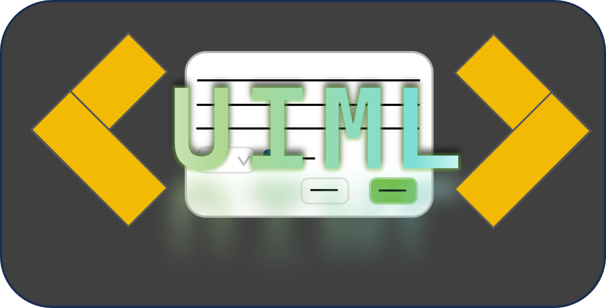

<div align="center">

<h1>uiml</h1>
A speacial XML format for drawing PySide6 UI interfaces A special XML format for drawing PySide6 UI interfaces
</div>
<br />
<div align = "center">
    <a href="https://github.com/xystudiocode/uiml/actions?query=workflow%3Adeploy">
        
    </a>
    <a href="https://github.com/xystudiocode/uiml/actions?query=workflow%3Atest">
        
    </a>
    <a href="https://pypi.org/project/uiml/">
        
    </a>
    <a href="https://img.shields.io/pypi/pyversions/uiml">
        
    </a>
    <a href="https://github.com/xystudiocode/uiml/blob/master/LICENSE">
        
    </a>
    <a href="https://github.com/xystudiocode/uiml/commits/main">
        
    </a>
</div>
<br />
<div align="center" style="line-height: 1;">
  <a href="./README.md"></a>
  <a href="./README-ZH_CN.md"></a>
</div>
<br />

--- 

## Introduction
uiml is a tool for drawing PySide6 UI interfaces using a special XML format. It defines the layout, style, and signals of the interface using a special XML format. The syntax of uiml is very simple and easy to learn and use. You can use uiml to create complex interfaces without writing a lot of code.

The syntax of uiml is based on XML, but it adds support for Python objects, so it has both the lightness of XML and the flexibility of Python objects.

## Installation
To use uiml, you need to install it first. You can install uiml using pip:

```bash
pip install uiml
```

## Usage
To use uiml, you need to create a uiml file and define the layout, style, and signals of the interface in it. Here is a simple example:

```xml
<layout name="central_layout" direction="v">
    <QLabel name="text" arg=["This is a label"] />
    <layout name="bottom_layout" direction="h" stretch="true">
        <QPushButton name="ok_button" arg=["Close the window"] style="selected" signals={"clicked": self.close} />
    </layout>
</layout>
```
## Properties
### layout
This is a layout object, which can add layout objects as children or add component objects.
Parameters:
- `name`: The name of the layout object, used to reference it in the code.
- `direction`: The direction of the layout, can be "v" (vertical) or "h" (horizontal), can be extended.
- `stretch`: The stretch factor of the layout object, can be "true" or "false".

### Widget
This is a component object, the tag name of the object is the name of the control, such as "QLabel", "QPushButton" etc.
Parameters:
- `name`: The name of the component object, used to reference it in the code.
- `arg`: The parameters of the component object, stored in a list, can be strings, lists, dictionaries etc.
- `kwarg`: The properties of the component object, with keywords, stored in a dictionary, can be strings, lists, dictionaries etc.
- `style`: The style of the component object, can be strings, lists, dictionaries etc.
- `signals`: The signals of the component object, stored in a dictionary, the key is the signal name, the value is the signal processing function.
- `init_steps`: The initialization steps of the component object, stored in a list, the sub-items are stored in a dictionary.
